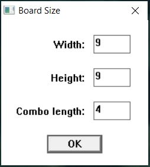
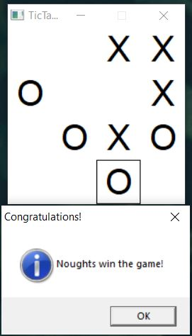

# Tic-Tac-Toe using WinAPI
Classic game as a Windows app

## Features
* User-selectable board size
* User-selectable win combo length

## Screenshots
   
   

## License
[MIT license](LICENSE.txt)
